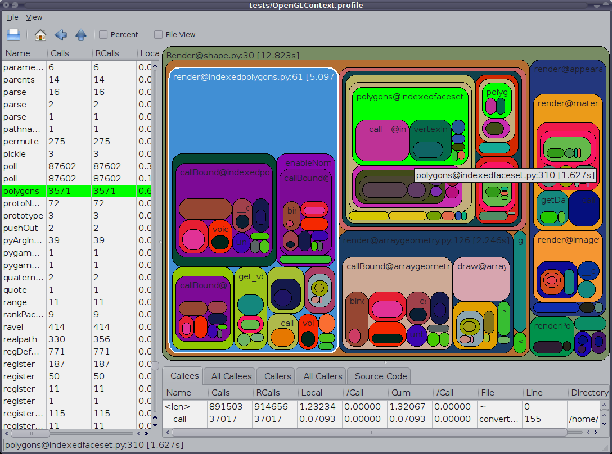

Speeding up PyPhysim
====================

A famous Donald Knuth statements is that "premature optimization is the
root of all evil". Before even thinking about optimizing some python code
that code should be fully tested with unittests. (see
:doc:`writing_unittests`).

With properly tested code, if the current speed is not enough the first
step is to profile the code to identify bottlenecks. The following section
describes how to profile code in python.

Profiling the Code
------------------

There are multiple ways to profile python code and visualize the profile
output. An easy way is to use the `%run` command in the ipython interpreter
with the `-p` option to run a python script with the python profiler and
present the results after the script finishes.

If you prefer to graphically visualize the profile data you can use the
`runsnakerun`_ program. In order to use it, first you need to run the
script using the cProfile module to generate the profile data and then you
can visualize the profile data with the runsnakerun program. That is

.. code-block:: bash

   $ python -m cProfile -o <outputfilename> <script-name> <options>
   $ runsnake <outputfilename>

Here is an image (from http://www.vrplumber.com/programming/runsnakerun/)
showing runsnakerun in action.

   
.. _runsnakerun: http://www.vrplumber.com/programming/runsnakerun/

After identifying which parts in the code need to be optimized, there are
multiple ways to achieve faster speeds in python. In PyPhysim we use Cython
for that, as described in the following section.

Implementing parts of PyPhysim in Cython
----------------------------------------

Some tutorials about using Cython can be found in
- http://docs.cython.org/src/userguide/tutorial.html
- http://wiki.cython.org/tutorials/numpy
- http://docs.cython.org/src/tutorial/index.html
- http://blog.perrygeo.net/2008/04/19/a-quick-cython-introduction/
- http://scipy-lectures.github.com/advanced/advanced_numpy/index.html#exercise-building-an-ufunc-from-scratch
- http://wiki.cython.org/PackageHierarchy

The setup.py and setup.cfg files are already properly configured to
compile the Cython extensions implement in PyPhysim. Simple call the command

.. code-block:: bash
                
   $ python setup.py build_ext

to compile all the Cython extensions.

In order to describe how the Cython extensions are implemented in PyPhysim
lets use the :func:`.count_bits` function in the :mod:`util.misc` module as
an example. We want to make it faster by re-implementing it in Cython.

First the :func:`.count_bits` function was implemented in pure python in
:mod:`util.misc` and properly tested in the util_package_test.py file along
the other functions in :mod:`util.misc`.

After that the file `misc_c.pyx` was created, which contains the
implementation of :func:`.count_bits` in Cython. Note that the name is
equal to the name of the module where the :func:`.count_bits` function
originally lives with an added `_c` and the `pyx` extension. The
re-implementation in Cython of any function in :mod:`util.misc` should be in
`misc_c.pyx`.

Then setup.py should be modified to create an extension from the
`misc_c.pyx` file (and any other source file it depends on). In the
`misc_c.pyx` case this corresponds to adding the code below to setup.py

.. code-block:: python

   misc_c = Extension(name="misc_c", sources=["util/misc_c.pyx"],
                include_dirs=[numpy.get_include()])

and adding "misc_c" to the 'ext_modules' list (an argument of the setup
function in the setup.py file).

At last, we add code to the :mod:`util.misc` module to use the functions
defined in `misc_c.pyx` so that for someone using importing the
:mod:`util.misc` module it is transparent if the functions are implemented
there (in python) or in `misc_c.pyx`. This can be easily done by putting
the code below at the end of the `misc.py` file.

.. code-block:: python

   # xxxxx Load Cython reimplementation of functions here xxxxxxxxxxxxxxxxxxxx
   try:
       # If the misc_c.so extension was compiled then any method defined there
       # will replace the corresponding method defined here.
       from c_extensions.misc_c import *
   except Exception:
       pass
   # xxxxxxxxxxxxxxxxxxxxxxxxxxxxxxxxxxxxxxxxxxxxxxxxxxxxxxxxxxxxxxxxxxxxxxxxx

The idea is that the user should never import the compiled Cython
extension, but only :mod:`util.misc`. The code above is enough to replace
any functions defined in misc.py by the equivalent function defined in
misc_c.pyx whenever the Cython extension is compiled, or use the native
python version when the Cython extension is not compiled.

.. note::
   
   The setup.cfg file is configured so that all the compiled Cython
   extensions are put in the `c_extensions` folder.

This method has the added benefit that we can run all the unittests on the
pure python versions, them compile the Cython extensions and run the
unittests again to test the Cython extensions.

Profiling Cython Code
~~~~~~~~~~~~~~~~~~~~~

See http://docs.cython.org/src/tutorial/profiling_tutorial.html

You can enable profiling for a Cython source file by putting

.. code-block:: python

   # cython: profile=True

in that source file.

.. todo::
   
   Verify is this is really necessary when the code is compiled into an
   extension of only if we had used the pyximport.

Once enabled, your Cython code will behave just like Python code when
called from the cProfile module. This means you can just profile your
Cython code together with your Python code using the same tools as for
Python code alone.

.. note::
   
   If your profiling is messed up because of the call overhead to some
   small functions that you rather do not want to see in your profile -
   either because you plan to inline them anyway or because you are sure
   that you can't make them any faster - you can use a special decorator to
   disable profiling for one function only:

   .. code-block:: python

      cimport cython

      @cython.profile(False)
      def my_often_called_function():
          pass

   This is important because once my_often_called_function is optimized
   enough you might want to optimize its calling function and the overhead
   from profiling my_often_called_function not added to
   my_often_called_function but to its calling function. Therefore,
   disabling profiling for my_often_called_function will give you more
   reliable information when optimizing its calling function.

   
Other Alternatives to speed-up python code
------------------------------------------

There are a number of alternatives to speed-up python code.

- you can use the weave module (inline or blitz methods) from scipy to
  spped up things here. See
  http://docs.scipy.org/doc/scipy/reference/tutorial/weave.html
  and
  http://www.scipy.org/PerformancePython
- You could use Cython
- You could try numexpr
  http://code.google.com/p/numexpr/
- You could try Numba
  http://jakevdp.github.com/blog/2012/08/24/numba-vs-cython/
- Use smart numpy broadcast tricks to avoid loops This is fast, but uses
  more memory. See the source code of the :meth:`.Modulator.demodulate`
  method.
